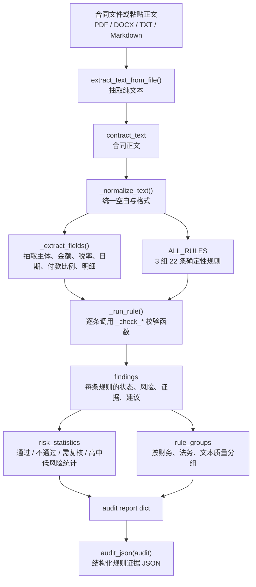
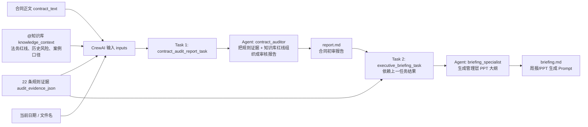
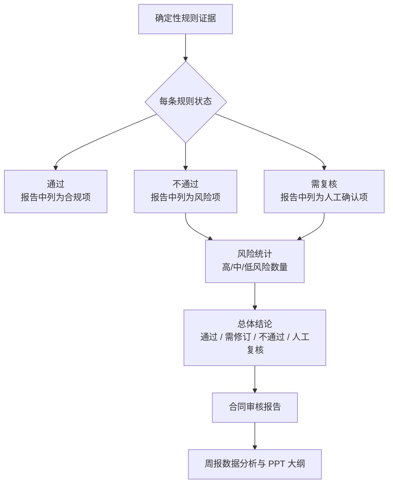

# CrewAI 与 22 条确定性规则证据流

这份说明回答三个问题：

1. 22 条确定性校验从何而来。
2. CrewAI 如何接收合同正文。
3. 规则引擎产出的结构化证据如何进入 CrewAI，并在报告与周报大纲中发挥作用。

## 1. 22 条规则从何而来

这 22 条不是运行时联网检索出来的法规条文，也不是 CrewAI 临场生成的规则，而是项目内置的一组“合同初审确定性清单”。

规则清单位于 [src/local_crewai_demo/contract_review.py](/Users/firingj/Projects/local_crewai_demo/src/local_crewai_demo/contract_review.py:63) 的 `ALL_RULES`，按企业合同初审常见职责拆成三组：

| 规则组 | 数量 | 主要覆盖 |
|---|---:|---|
| 财务条款审核 | 12 | 金额大小写、明细合计、税额税率、付款比例、付款方式、币别、交付验收、违约金、保证金 |
| 法务合规审核 | 7 | 主体一致性、主体信息完整性、必备条款、日期、违约金上限、违约对等、不可抗力 |
| 文本质量审核 | 3 | 内部一致性、数字计算、错别字/语义歧义 |

它们的来源口径是：把企业采购/服务合同初审中高频、可用程序稳定判断的事项固化为本地规则；把需要语义判断、历史画像、法规红线、主体尽调的事项交给小浣熊的知识库、联网检索和 Agent 编排。也就是说，规则引擎只负责“能确定就确定”的结构化证据，不负责替代法务判断。

## 2. 本地审核节点如何处理合同



关键代码链路：

| 环节 | 代码位置 | 作用 |
|---|---|---|
| 文件转文本 | [contract_review.py](/Users/firingj/Projects/local_crewai_demo/src/local_crewai_demo/contract_review.py:95) | 从 PDF/DOCX/TXT 等文件抽取合同正文 |
| 规则清单 | [contract_review.py](/Users/firingj/Projects/local_crewai_demo/src/local_crewai_demo/contract_review.py:63) | 定义 3 组 22 条确定性校验 |
| 审核入口 | [contract_review.py](/Users/firingj/Projects/local_crewai_demo/src/local_crewai_demo/contract_review.py:107) | 标准化正文、抽字段、跑规则、汇总结论 |
| GUI 上传处理 | [gui.py](/Users/firingj/Projects/local_crewai_demo/src/local_crewai_demo/gui.py:269) | 接收前端上传/粘贴合同并触发审核 |
| CLI 输入处理 | [main.py](/Users/firingj/Projects/local_crewai_demo/src/local_crewai_demo/main.py:17) | 命令行模式下读取样本合同并构造 CrewAI 输入 |

## 3. CrewAI 如何接收正文与规则证据

CrewAI 本身不是先去解析文件。项目先在本地把合同处理成两份输入，再交给 CrewAI：

1. `contract_text`：合同全文，最多截取前 30000 字符。
2. `audit_evidence_json`：22 条规则跑完后的结构化证据。

GUI 模式下，这两份输入在 [gui.py](/Users/firingj/Projects/local_crewai_demo/src/local_crewai_demo/gui.py:328) 构造：

```python
inputs = {
    "file_name": file_name,
    "contract_text": contract_text[:30000],
    "audit_evidence_json": audit_json(audit),
    "knowledge_context": _load_knowledge_context(),
    "current_date": datetime.now().strftime("%Y-%m-%d"),
}
```

CLI 模式下，同样在 [main.py](/Users/firingj/Projects/local_crewai_demo/src/local_crewai_demo/main.py:17) 构造：

```python
contract_text = extract_text_from_file(contract_path)
audit = audit_contract_text(contract_text, contract_path.name)
```

随后这些字段被插入 CrewAI 的任务模板。任务模板位于 [src/local_crewai_demo/config/tasks.yaml](/Users/firingj/Projects/local_crewai_demo/src/local_crewai_demo/config/tasks.yaml:1)，其中明确包含：

```yaml
合同全文如下：
{contract_text}

系统已经按 3 组 22 条规则完成字段抽取和精确计算校验，结构化结果如下：
{audit_evidence_json}
```

## 4. CrewAI 在这里的作用



所以 CrewAI 的定位不是“替代规则引擎”，而是工作流编排和报告生成层：

| 能力 | 在本项目中的具体作用 |
|---|---|
| 接收合同正文 | 通过 `contract_text` 进入任务 Prompt，用于解释条款语境 |
| 接收规则证据 | 通过 `audit_evidence_json` 进入任务 Prompt，作为不可随意改写的判定依据 |
| 接收知识库 | 通过 `knowledge_context` 注入法务红线和历史案例口径 |
| 多 Agent 顺序编排 | 先生成合同审核报告，再基于报告与证据生成管理层汇报大纲 |
| 约束模型输出 | 任务模板要求“不得改变结构化结果中的通过/不通过/需复核判断” |
| 可选联网 | 当 `SENSENOVA_SEARCH_ENABLE=true` 时，通过 LiteLLM `extra_body.search_enable=true` 打开小浣熊/商汤模型原生联网检索能力 |

## 5. 规则证据在报告中的作用



一句话总结：

> 22 条规则负责把合同里能确定判断的内容变成“结构化证据”；CrewAI 负责把合同正文、结构化证据、知识库红线和后续汇报任务串成可读、可复核、可沉淀的工作流产物。

