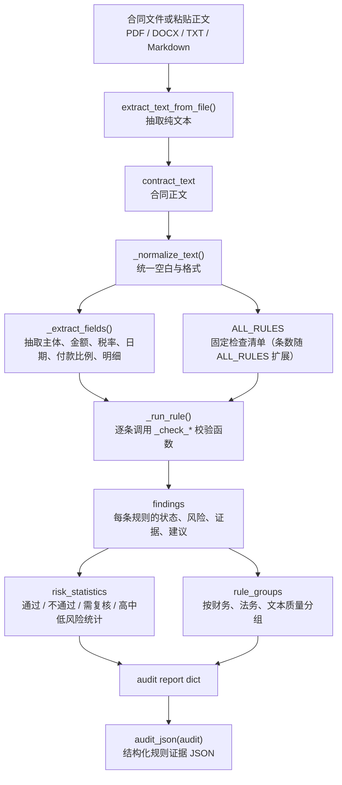
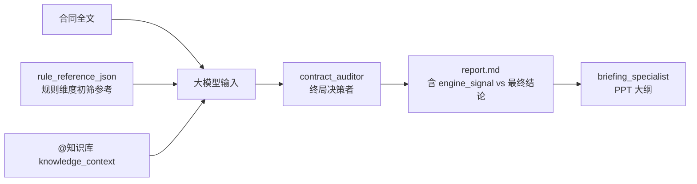
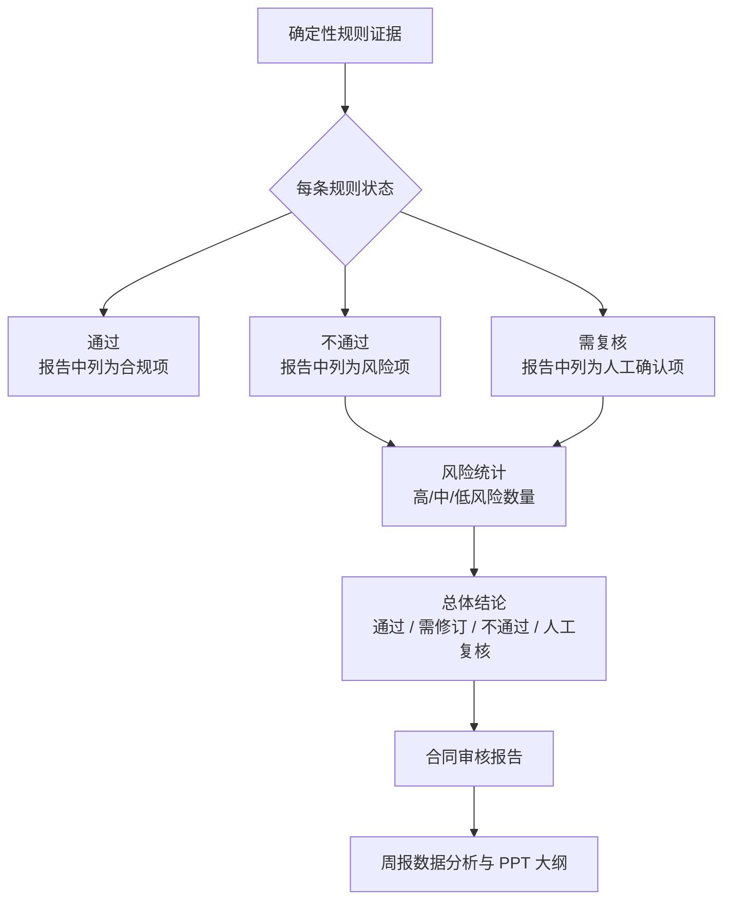

# CrewAI 与确定性规则证据流

这份说明回答三个问题：

1. 固定检查清单从何而来。
2. CrewAI 如何接收合同正文。
3. 规则引擎产出的结构化证据如何进入 CrewAI，并在报告与周报大纲中发挥作用。

## 1. 固定检查清单从何而来

规则清单位于 [contract_review.py](/Users/firingj/Projects/local_crewai_demo/src/local_crewai_demo/contract_review.py:69) 的 `ALL_RULES`：**条数不固定**，当前随法规与合同类型扩展（实现时以 `len(ALL_RULES)` 为准）。每条均对应国家级法律法规（见 [`knowledge/contract_audit_framework.md`](../knowledge/contract_audit_framework.md)）。

按六组职责拆分，并按合同类型（T1 买卖 / T2 技术服务 / T3 承揽 / T4 混合）区分适用边界：

| 规则组 | 数量（当前） | 主要覆盖 | 核心法律依据 |
|---|---:|---|---|
| I. 合同效力与主体 | 4 | 主体资格、名称一致、必备条款、日期 | 《民法典》143、470、502条 |
| II. 标的与履行 | 3 | 交付验收、知识产权、保密 | 《民法典》621、845—850条 |
| III. 价款税务与结算 | 9 | 金额、税率、付款、价税表述 | 《增值税法》；《保障中小企业款项支付条例》 |
| IV. 违约救济与争议 | 5 | 违约金、对等性、不可抗力、争议解决 | 《民法典》585、590条；《仲裁法》5条 |
| V. 担保与多方关系 | 2 | 保证金、连带责任 | 《民法典》586、518、592条 |
| VI. 文本一致与表述 | 3 | 跨条款一致、计算、语病 | 《民法典》510、142、496条 |

明细见 [`knowledge/contract_audit_rules.md`](../knowledge/contract_audit_rules.md)。

它们的来源口径是：把 **国家法律法规中可程序稳定判断** 的事项固化为本地规则；把需要深度语义判断、历史画像、主体尽调的事项交给小浣熊的知识库与联网检索。

## 2. 本地审核节点如何处理合同



关键代码链路：

| 环节 | 代码位置 | 作用 |
|---|---|---|
| 文件转文本 | [contract_review.py](/Users/firingj/Projects/local_crewai_demo/src/local_crewai_demo/contract_review.py:95) | 从 PDF/DOCX/TXT 等文件抽取合同正文 |
| 规则清单 | [contract_review.py](/Users/firingj/Projects/local_crewai_demo/src/local_crewai_demo/contract_review.py:69) | 定义固定检查项及法律依据 |
| 审核入口 | [contract_review.py](/Users/firingj/Projects/local_crewai_demo/src/local_crewai_demo/contract_review.py:107) | 标准化正文、抽字段、跑规则、汇总结论 |
| GUI 上传处理 | [gui.py](/Users/firingj/Projects/local_crewai_demo/src/local_crewai_demo/gui.py:269) | 接收前端上传/粘贴合同并触发审核 |
| CLI 输入处理 | [main.py](/Users/firingj/Projects/local_crewai_demo/src/local_crewai_demo/main.py:17) | 命令行模式下读取样本合同并构造 CrewAI 输入 |

## 3. CrewAI 如何接收正文与规则证据

CrewAI 本身不是先去解析文件。项目先在本地把合同处理成两份输入，再交给 CrewAI：

1. `contract_text`：合同全文，最多截取前 30000 字符。
2. `audit_evidence_json`：固定检查跑完后的结构化证据。

GUI 模式下，这两份输入在 [gui.py](/Users/firingj/Projects/local_crewai_demo/src/local_crewai_demo/gui.py:328) 构造：

```python
inputs = {
    "file_name": file_name,
    "contract_text": contract_text[:30000],
    "audit_evidence_json": audit_json(audit),
    "knowledge_context": _load_knowledge_context(),
    "current_date": datetime.now().strftime("%Y-%m-%d"),
}
```

CLI 模式下，同样在 [main.py](/Users/firingj/Projects/local_crewai_demo/src/local_crewai_demo/main.py:17) 构造：

```python
contract_text = extract_text_from_file(contract_path)
audit = audit_contract_text(contract_text, contract_path.name)
```

随后这些字段被插入 CrewAI 的任务模板。任务模板位于 [src/local_crewai_demo/config/tasks.yaml](/Users/firingj/Projects/local_crewai_demo/src/local_crewai_demo/config/tasks.yaml:1)，其中明确包含：

```yaml
合同全文如下：
{contract_text}

系统已经按固定检查清单完成字段抽取和精确计算校验，结构化结果如下：
{audit_evidence_json}
```

## 4. CrewAI / 大模型在这里的作用



**规则参考层**负责列出应检查的维度与初筛信号；**大模型**负责终局判断与报告。数值类优先采信引擎；语义类可修正误报并须引用合同原文。

## 5. 规则证据在报告中的作用



一句话总结：

> 规则参考层提供应查维度与初筛信号；大模型结合知识库产出终局报告；人做法务终审。

